> 在线视频：[尚硅谷3小时速通Docker教程，雷神带练docker部署到实战！](https://www.bilibili.com/video/BV1Zn4y1X7AZ)
> 课程资料: [尚硅谷2024新版3小时速通Docker教程](https://pan.baidu.com/s/1jdN7HjjO6JDNOSGgd3r8pA?pwd=yyds )
> 雷神笔记：[**Docker - 快速通关 （3h）**](https://www.yuque.com/leifengyang/sutong/au0lv3sv3eldsmn8)

# Docker介绍

> Docker 官网： https://www.docker.com/

Docker 是一个开源的容器化平台，它允许开发者将应用程序及其依赖项打包到一个轻量级的、可移植的容器中。


## Docker优势

### **一致的环境**

**开发与生产环境一致性**：Docker 确保应用程序在开发、测试和生产环境中运行一致。无论在哪个环境中，应用程序的行为都是相同的，因为所有的依赖项和配置都打包在容器中。

**避免“在我的机器上可以运行”的问题**：由于环境一致性，开发者可以避免因环境差异导致的运行问题。

### **隔离性**

**资源隔离**：每个 Docker 容器都是独立的，它们之间相互隔离，不会相互干扰。这意味着你可以运行多个容器，每个容器都可以有自己的依赖项和配置，而不会影响其他容器。

**安全性**：由于隔离性，容器内的应用程序不会直接访问宿主机的资源，从而提高了安全性。

###  **可移植性**

**跨平台运行**：Docker 容器可以在任何支持 Docker 的平台上运行，无论是 Linux、Windows 还是 macOS。这使得应用程序可以在不同的环境中轻松部署。

**云平台支持**：大多数云服务提供商都支持 Docker，使得应用程序可以轻松地在不同的云环境中迁移和扩展。

### **快速部署和扩展**

**快速启动**：Docker 容器启动速度非常快，通常只需几秒钟。这使得开发者在开发和测试过程中可以快速启动和停止容器。

**水平扩展**：Docker 容器可以轻松地进行水平扩展，通过启动多个容器实例来处理更多的请求。

### **版本控制和依赖管理**

**版本控制**：Docker 镜像可以进行版本控制，开发者可以轻松地回滚到之前的版本，或者在不同的版本之间切换。

**依赖管理**：Docker 镜像包含了应用程序的所有依赖项，确保在不同的环境中运行时不会缺少任何依赖。

###  **资源效率**

**轻量级**：Docker 容器比虚拟机更轻量级，因为它们共享宿主机的操作系统内核，而不是每个容器都运行一个完整的操作系统。

**资源利用率高**：由于轻量级和高效的资源管理，Docker 容器可以更高效地利用系统资源。

### **社区和生态系统**

**丰富的镜像库**：Docker Hub 提供了大量的公共镜像，开发者可以直接使用这些镜像来快速构建应用程序。

**强大的生态系统**：Docker 有庞大的社区支持和丰富的工具链，如 Kubernetes、Docker Compose 等，可以帮助开发者更高效地管理和部署容器化应用。

### **简化开发流程**

**简化开发环境配置**：开发者可以使用 Docker 来定义开发环境，确保所有团队成员使用相同的环境进行开发。

**简化测试流程**：测试人员可以使用 Docker 容器来运行测试，确保测试环境与生产环境一致。


## Docker组件

在 Docker 生态系统中，各个组件之间有着紧密的联系，共同协作以实现容器化应用的构建、分发和运行。以下是 Docker 中各个关键组件之间的关系：
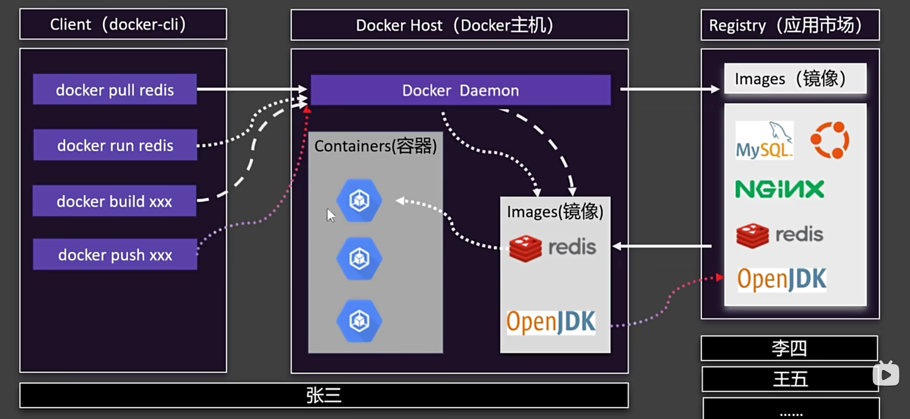


### **Docker CLI (命令行接口)**

**定义**：Docker CLI 是用户与 Docker 交互的主要工具。它提供了一组命令，允许用户管理 Docker 镜像、容器、网络和存储等资源。

**作用**：用户通过 Docker CLI 发送命令，这些命令会被发送到 Docker 守护进程（Docker Host）进行处理。

**示例命令**：`docker run`, `docker build`, `docker pull`, `docker push` 等。

### **Docker Host (Docker 守护进程)**
**定义**：Docker Host 是运行 Docker 守护进程（`dockerd`）的机器。守护进程负责管理 Docker 对象，如容器、镜像、网络和卷等。

**作用**：Docker Host 接收来自 Docker CLI 的命令，并执行相应的操作。它还负责与 Docker 注册表（仓库）进行通信，以拉取或推送镜像。

**关系**：Docker Host 是 Docker CLI 和 Docker 容器之间的桥梁。

### **容器 (Container)**
**定义**：容器是 Docker 中的运行实例，它是基于镜像创建的。容器包含了应用程序及其所有依赖项，并且与宿主机和其他容器隔离。

**作用**：容器提供了一个轻量级的、可移植的运行环境，使得应用程序可以在任何支持 Docker 的环境中运行。

**关系**：容器是基于镜像创建的，并且由 Docker Host 管理。容器可以被启动、停止、删除和迁移。

### **镜像 (Image)**
**定义**：镜像是用于创建容器的只读模板。它包含了运行应用程序所需的所有文件、库、配置和依赖项。

**作用**：镜像是容器的构建块，它定义了容器的行为和环境。镜像可以通过 Dockerfile 构建，也可以从 Docker 仓库中拉取。

**关系**：镜像是容器的蓝图，容器是镜像的运行实例。镜像可以被推送到 Docker 仓库，也可以从仓库中拉取。

###  **仓库 (Registry)**
**定义**：仓库是存储和分发 Docker 镜像的地方。Docker Hub 是最常用的公共仓库，但也可以使用私有仓库。

**作用**：仓库允许用户共享和分发镜像，使得团队成员可以轻松获取和使用相同的镜像。

**关系**：Docker Host 可以从仓库中拉取镜像，也可以将本地构建的镜像推送到仓库。Docker CLI 提供了 `docker pull` 和 `docker push` 命令来与仓库交互。

### 关系总结
- **Docker CLI** 是用户与 Docker 交互的接口，用户通过它发送命令。
- **Docker Host** 是运行 Docker 守护进程的机器，负责处理 Docker CLI 的命令并管理容器和镜像。
- **容器** 是基于镜像创建的运行实例，由 Docker Host 管理。
- **镜像** 是容器的只读模板，定义了容器的行为和环境。
- **仓库** 是存储和分发镜像的地方，Docker Host 可以从仓库中拉取镜像，也可以将本地镜像推送到仓库。

通过这些组件的协作，Docker 提供了一个完整的容器化解决方案，使得应用程序的构建、分发和运行变得更加简单和高效。


## 应用程序部署方式

传统部署、虚拟化部署和容器部署是三种不同的应用程序部署方式，它们在资源利用、隔离性、可移植性和管理复杂性等方面有着显著的区别。以下是它们的详细比较：

### **传统部署 (Traditional Deployment)**

**特点**：

**直接在物理服务器上运行**：应用程序直接安装在物理服务器上，使用服务器的操作系统及其资源。

**资源共享有限**：多个应用程序通常不能在同一台物理服务器上运行，因为它们可能会相互干扰。

**环境依赖性强**：应用程序对操作系统和服务器环境的依赖性强，环境差异可能导致应用程序无法正常运行。

**扩展性差**：扩展应用程序通常需要增加物理服务器，成本高且管理复杂。

**优点**：

- **简单直接**：部署过程相对简单，不需要额外的虚拟化或容器化技术。
- **性能高**：直接在物理硬件上运行，性能通常较高。

**缺点**：

- **资源利用率低**：物理服务器的资源利用率通常较低，因为多个应用程序不能共享同一台服务器。
- **环境一致性差**：开发、测试和生产环境可能存在差异，导致“在我的机器上可以运行”的问题。
- **扩展性差**：扩展应用程序需要增加物理服务器，成本高且管理复杂。

### **虚拟化部署 (Virtualization Deployment)**

**特点**：

- **在虚拟机上运行**：应用程序运行在虚拟机（VM）中，每个虚拟机都有自己的操作系统（Guest OS）。
- **资源隔离**：每个虚拟机相互隔离，不会相互干扰，提高了安全性。
- **资源共享**：多个虚拟机可以运行在同一台物理服务器上，提高了资源利用率。
- **可移植性**：虚拟机可以在不同的物理服务器之间迁移，提高了可移植性。

**优点**：

- **资源利用率高**：多个虚拟机可以共享同一台物理服务器的资源，提高了资源利用率。
- **隔离性好**：每个虚拟机相互隔离，提高了安全性。
- **可移植性好**：虚拟机可以在不同的物理服务器之间迁移，提高了可移植性。

**缺点**：

- **性能开销**：虚拟机需要运行完整的操作系统，性能开销较大。
- **启动时间长**：虚拟机启动时间较长，通常需要几分钟。
- **管理复杂**：虚拟机的管理和维护相对复杂，需要专门的虚拟化管理工具。

### **容器部署 (Container Deployment)**

**特点**：

- **在容器中运行**：应用程序运行在容器中，容器共享宿主机的操作系统内核。
- **轻量级**：容器比虚拟机更轻量级，因为它们不需要运行完整的操作系统。
- **资源隔离**：容器之间相互隔离，不会相互干扰，提高了安全性。
- **快速启动**：容器启动速度非常快，通常只需几秒钟。
- **可移植性**：容器可以在任何支持 Docker 的环境中运行，提高了可移植性。

**优点**：

- **轻量级**：容器比虚拟机更轻量级，资源利用率高。
- **快速启动**：容器启动速度非常快，通常只需几秒钟。
- **可移植性好**：容器可以在任何支持 Docker 的环境中运行，提高了可移植性。
- **环境一致性好**：开发、测试和生产环境一致，避免了“在我的机器上可以运行”的问题。

**缺点**：

- **隔离性相对较弱**：虽然容器之间相互隔离，但隔离性不如虚拟机强。
- **依赖宿主机内核**：容器依赖宿主机的操作系统内核，因此在不同操作系统上运行可能会有兼容性问题。

### 总结

| 特性       | 传统部署 | 虚拟化部署 | 容器部署 |
| ---------- | -------- | ---------- | -------- |
| 资源利用率 | 低       | 高         | 高       |
| 隔离性     | 差       | 好         | 较好     |
| 可移植性   | 差       | 好         | 好       |
| 启动时间   | 快       | 慢         | 快       |
| 性能开销   | 低       | 高         | 低       |
| 环境一致性 | 差       | 较好       | 好       |
| 扩展性     | 差       | 好         | 好       |
| 管理复杂性 | 低       | 高         | 中       |

通过以上比较可以看出，容器部署在资源利用率、启动时间、可移植性和环境一致性等方面具有显著优势，但在隔离性和对宿主机内核的依赖性方面存在一定的局限性。虚拟化部署则在隔离性和资源利用率方面表现较好，但性能开销和管理复杂性较高。传统部署则相对简单直接，但在资源利用率和环境一致性方面存在明显不足。

# 安装Docker

可以使用虚拟机或者购买计费云服务器

> 国内常见云平台：
> [阿里云](https://promotion.aliyun.com/ntms/act/ambassador/sharetouser.html?userCode=50sid5bu&utm_source=50sid5bu)、[腾讯云](https://curl.qcloud.com/iyFTRSJb)、[华为云](https://activity.huaweicloud.com/discount_area_v5/index.html?fromacct=d1a6f32e-d6d0-4702-9213-eafe022a0708&utm_source=bGVpZmVuZ3lhbmc==&utm_medium=cps&utm_campaign=201905)、[青云](https://www.qingcloud.com/)......
>
> 使用 CentOS 7.9
> WindTerm下载：https://github.com/kingToolbox/WindTerm/releases/download/2.6.0/WindTerm_2.6.1_Windows_Portable_x86_64.zip

## 移除旧版本

卸载 Docker 的过程取决于你使用的操作系统和安装方式。以下是几种常见操作系统的卸载步骤：

```bash
# CentOS 移除旧版本docker
sudo yum remove docker \
                  docker-client \
                  docker-client-latest \
                  docker-common \
                  docker-latest \
                  docker-latest-logrotate \
                  docker-logrotate \
                  docker-engine
```

### **Ubuntu/Debian**

#### 卸载 Docker Engine
1. **卸载 Docker 包**：
   ```bash
   sudo apt-get purge docker-ce docker-ce-cli containerd.io
   ```

2. **删除 Docker 数据**：
   ```bash
   sudo rm -rf /var/lib/docker
   sudo rm -rf /var/lib/containerd
   ```

3. **删除 Docker 配置文件**（可选）：
   ```bash
   sudo rm -rf /etc/docker
   ```

4. **删除 Docker 用户组**（可选）：
   ```bash
   sudo delgroup docker
   ```

#### 卸载 Docker Compose（如果安装了）
1. **卸载 Docker Compose**：
   ```bash
   sudo rm /usr/local/bin/docker-compose
   ```

### **CentOS/RHEL**

#### 卸载 Docker Engine
1. **卸载 Docker 包**：
   ```bash
   sudo yum remove docker-ce docker-ce-cli containerd.io
   ```

2. **删除 Docker 数据**：
   ```bash
   sudo rm -rf /var/lib/docker
   sudo rm -rf /var/lib/containerd
   ```

3. **删除 Docker 配置文件**（可选）：
   ```bash
   sudo rm -rf /etc/docker
   ```

4. **删除 Docker 用户组**（可选）：
   ```bash
   sudo delgroup docker
   ```

#### 卸载 Docker Compose（如果安装了）
1. **卸载 Docker Compose**：
   ```bash
   sudo rm /usr/local/bin/docker-compose
   ```

### **Windows**

#### 卸载 Docker Desktop
1. **打开“控制面板”**：
   - 点击“开始”菜单，搜索并打开“控制面板”。

2. **卸载程序**：
   - 在“控制面板”中，选择“程序” > “程序和功能”。
   - 找到“Docker Desktop”，右键点击并选择“卸载”。

3. **删除 Docker 数据**（可选）：
   - 打开文件资源管理器，导航到 `C:\ProgramData\DockerDesktop` 目录，删除其中的内容。

### **macOS**

#### 卸载 Docker Desktop
1. **打开“应用程序”文件夹**：
   - 在 Finder 中，导航到“应用程序”文件夹。

2. **删除 Docker Desktop**：
   
   - 找到“Docker”应用程序，将其拖到“废纸篓”中。
   
3. **清空废纸篓**：
   - 右键点击“废纸篓”图标，选择“清空废纸篓”。

4. **删除 Docker 数据**（可选）：
   - 打开终端，运行以下命令删除 Docker 数据：
     ```bash
     rm -rf ~/Library/Containers/com.docker.docker
     rm -rf ~/Library/Application\ Support/Docker\ Desktop
     rm -rf ~/Library/Group\ Containers/group.com.docker
     ```

### 总结
卸载 Docker 的过程主要包括卸载 Docker 包、删除 Docker 数据和配置文件。根据操作系统的不同，卸载步骤略有差异。确保在卸载前备份重要数据，以免丢失。

## 安装/更新最新版本

> 官网完整手册： https://docs.docker.com/desktop/install/linux/

```bash
# 配置docker yum源。
sudo yum install -y yum-utils
sudo yum-config-manager \
--add-repo \
http://mirrors.aliyun.com/docker-ce/linux/centos/docker-ce.repo


# 安装 最新 docker
sudo yum install -y docker-ce docker-ce-cli containerd.io docker-buildx-plugin docker-compose-plugin

# 启动& 开机启动docker； enable + start 二合一
systemctl enable docker --now

# 配置加速
sudo mkdir -p /etc/docker
sudo tee /etc/docker/daemon.json <<-'EOF'
{
    "registry-mirrors": [
        "https://mirror.ccs.tencentyun.com"
    ]
}
EOF


sudo systemctl daemon-reload
sudo systemctl restart docker
```

Linux配置镜像站：
> Docker安装包及镜像站:https://github.com/tech-shrimp/docker_installer

```bash
sudo vi /etc/docker/daemon.json
```

输入下列内容，最后按ESC，输入 :wq! 保存退出。

```json
{
    "registry-mirrors": [
        "https://docker.1panel.live",
        "https://mirror.ccs.tencentyun.com",
        "https://registry.docker-cn.com",
        "http://hub-mirror.c.163.com",
        "https://docker.m.daocloud.io",
        "https://hub.rat.dev"
    ]
}
```

当你修改了 Docker 的 `daemon.json` 配置文件后，通常需要重启 Docker 服务以使更改生效。

```bash
sudo systemctl restart docker
```

# Docker命令

> 启动一个nginx,并将它的首页改为自己的页面，发布出去，让所有人都能使用
>
> Docker仓库地址： https://hub.docker.com/

```bash
# 搜索镜像
docker search nginx

# 下载镜像
docker pull nginx

# 下载指定版本镜像
docker pull nginx:1.26.0

# 下载最新版本镜像
docker pull nginx:latest

# 查看所有镜像
docker images

# 删除指定id的镜像
docker rmi e784f4560448


# 查看运行中的容器
# CONTAINER ID:容器ID, IMAGE:镜像, COMMAND:启动命令, CREATED:启动时间
# STATUS：启动状态(Up 已启动, Exited 已停止), PORTS:端口, NAMES: 容器名称(随机命名)
               
docker ps

# 查看所有容器
docker ps -a

# 查看所有容器ID
docker ps -aq

# 运行一个新容器
# 使用docker run 时若不指定版本,默认为最新版本,若本地没有最新版本则自动拉取
# 启动容器后命令窗口不可关闭,否则服务停止
docker run nginx

### 启动容器 ###
# 根据容器ID 
docker start 87e68fccff21
# 可以用容器ID的前几位,能够和其他容器区分即可 
docker start 87e
# 可以根据容器名 NAMES
docker start great_noyce

### 停止容器 ###
# 可以根据容器ID  
docker stop c9cd218ec15b
# 可以用容器ID的前几位,能够和其他容器区分即可 
docker stop c9c
# 可以根据容器名 NAMES  
docker stop sharp_montalcini

# 重启容器 
# 同上,可使用容器ID,容器ID前缀,容器名称
# 无论是否已启动,均可使用
docker restart 592

# 查看容器资源占用情况
# 同上,可使用容器ID,容器ID前缀,容器名称
docker stats 592

# 查看容器日志
# 同上,可使用容器ID,容器ID前缀,容器名称
docker logs 592

# 删除指定容器
# 同上,可使用容器ID,容器ID前缀,容器名称
# 删除的前提时并未使用
docker rm 592
# 若在使用中,可使用 force 强制删除
docker rm -f 592

# 强制删除查询到的容器
docker rm -f $(docker ps -aq)

# 后台启动容器
# 后台启动时可以给容器指定命名,否则会随机命名
docker run -d --name mynginx nginx
# 后台启动并暴露端口 
# 端口映射 -p 外部端口：内部端口 88:80 将内部的80端口映射到外部的88端口上
# 因为容器之间是相互隔离的,多个容器之间内部端口可以重复
# 外部端口对应当前主机的端口,不可重复
docker run -d --name mynginx -p 80:80 nginx

# 进入容器内部
# 使用 exit 退出交互模式
# /bin/bash 也可直接写作 bash
docker exec -it mynginx /bin/bash
# 例如修改Nginx首页内容,切换到 /usr/share/nginx/html
echo "<h1>Hello Shiguang Nginx </h1>" > index.html

# 提交容器变化打成一个新的镜像
# 打包的镜像名必须小写
# 新镜像创建成功后 可使用 docker images 查看
docker commit -m "update Nginx index.html" myNginx shiguangnginx:v1.0.0

# 保存镜像为指定文件
docker save -o mynginx.tar shiguangnginx:v1.0.0

# 删除多个镜像
docker rmi bde7d154a67f 94543a6c1aef e784f4560448

# 加载镜像
docker load -i mynginx.tar 


# 登录 docker hub
# 使用用户名或者邮箱进行登录
docker login

# 重新给镜像打标签
# tag 当前目录文件名 推送到远程路径仓库名
docker tag mynginx:v1.0 leifengyang/mynginx:v1.0

# 可以再提交一个最新版本的镜像,不然拉取时不指定版本号会出错
docker tag mynginx:v1.0 leifengyang/mynginx:latest

# 推送镜像
docker push leifengyang/mynginx:v1.0
```

# Docker存储

## 目录挂载

在 Docker 中，目录挂载（Directory Mounting）是将宿主机的目录直接挂载到容器内的某个路径。

Docker 容器是临时的，容器被删除后，容器内的数据也会随之丢失。通过目录挂载，可以将数据存储在宿主机上，即使容器被删除，数据仍然保留。

将宿主机的 `/host/data` 目录挂载到容器内的 `/container/data` 目录，容器内的数据会持久化到宿主机的 `/host/data` 目录中。

```bash
docker run -v /host/data:/container/data my_image
```

例如我将Docker容器的Nginx资源目录挂载到宿主机指定目录

```
docker run -d -p 80:80 --name app -v /home/docker/nginx:/usr/share/nginx/html nginx
```

做了目录挂载之后，以挂载的宿主机目录为准，所需的文件需要自行创建

## 卷映射

> 区分目录挂载和卷映射，可通过挂载的路径中是否包含 / 或者 ./来判断

在 Docker 中，卷映射（Volume Mounting）是将 Docker 管理的卷（Volume）挂载到容器内的某个路径

Docker会自动创建一个存储位置，即使在容器初始启动的时候就和容器内部的文件保持完全一致。

映射后的配置文件会保持同步，即修改了宿主机映射的配置文件后，容器内部的配置文件也会同步修改

即使删除容器，卷内的数据仍会保存下来。

例如要映射nginx配置文件，启动时可以使用 `-v <volume_name>:/etc/nginx` 命令

映射的文件统一放在`/var/lib/docker/volumes/<volume-name>` 目录下

```bash
# 命令查看所有卷
docker volume ls

# 创建一个卷
docker volume create <volume_name>

# 查看卷信息
docker volume inspect <volume_name>
```

# Docker网络

docker 为每个容器分配了唯一IP，使容器IP + 端口可以互相访问，不过这个IP由于各种原因可能会变化

Docker每个应用启动的时候都会加入一个Docker的默认网络`docker0`

```bash
# ip addr 可以查到docker0相关信息
6: docker0: <BROADCAST,MULTICAST,UP,LOWER_UP> mtu 1500 qdisc noqueue state UP group default 
    link/ether 02:42:63:90:8e:52 brd ff:ff:ff:ff:ff:ff
    inet 172.17.0.1/16 brd 172.17.255.255 scope global docker0
       valid_lft forever preferred_lft forever
    inet6 fe80::42:63ff:fe90:8e52/64 scope link
```

也可以使用 `docker [container] inspect <image name>` 查看容器细节内容，可在`Networks`配置项中找到网关`Gateway` 和 IP地址 `IPAddress`

```bash
"Networks": {
                "bridge": {
                    "IPAMConfig": null,
                    "Links": null,
                    "Aliases": null,
                    "MacAddress": "02:42:ac:11:00:03",
                    "NetworkID": "75e1075b52c1ed9dff76bb29a0d84c553839cc414c9ac4fdee04fae33329fc4e",
                    "EndpointID": "190ce9d1618de4446460ff220629f743e923d7ad599d97fd0135d0d77884e98b",
                    "Gateway": "172.17.0.1",
                    "IPAddress": "172.17.0.3",
                    "IPPrefixLen": 16,
                    "IPv6Gateway": "",
                    "GlobalIPv6Address": "",
                    "GlobalIPv6PrefixLen": 0,
                    "DriverOpts": null,
                    "DNSNames": null
                }
            }
```


为了形成稳定访问的网络，Docker提供了自定义网络机制，默认`docker0`是不支持使用主机域名访问，需要创建一个自定义网络，让启动的容器加入到自定义网络，容器的名称便可以作为一个稳定的域名

```bash 
# 创建一个自定义网络
docker network create <network_name>

# 查看所有docker网络
docker network ls

# 容器启动时使用 --network 指定自定义网络
docker run -d -p 88:80 --name app1 --network mynet nginx

# 使用自定义网络作为域名进行访问,需使用内部端口
[root@localhost docker]# docker exec -it app1 bash
root@411c92f75eb1:/# curl http://app2:80

```


# 实战练习

## Redis主从同步集群

> 此处使用非官方Redis镜像，预设好了很多环境变量，配置相对简单
>
> 镜像仓库地址：https://hub.docker.com/r/bitnami/redis

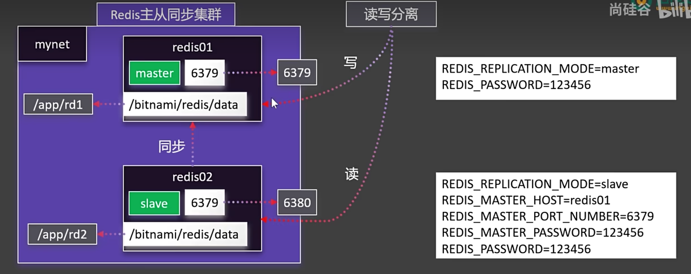

使用`-e` 配置环境变量

```bash
docker run \
    -e ALLOW_EMPTY_PASSWORD=yes \
    -v /path/to/redis-persistence:/bitnami/redis/data \
    bitnami/redis:latest
```

例如此处使用下列命令

```bash
#自定义网络
docker network create mynet

# 主节点 redis01
docker run -d -p 6379:6379 \
	-v /home/docker/redis/redis01:/bitnami/redis/data \
	-e REDIS_REPLICATION_MODE=master \
	-e REDIS_PASSWORD=shiguang \
	--network mynet --name redis01 \
	bitnami/redis

# 此时Redis并未处于运行状态,因为映射的文件没有操作权限
# 给目录授予权限
chmod -R 777 /home/docker/redis/redis01

# 重启实例
docker restart redis01

# 用于映射redis02目录
mkdir -p /home/docker/redis/redis02

# 给redis02映射目录赋予操作权限
chmod -R 777 /home/docker/redis/redis02

# 从节点 redis02
docker run -d -p 6380:6379 \
	-v /home/docker/redis/redis02:/bitnami/redis/data \
	-e REDIS_REPLICATION_MODE=slave \
	-e REDIS_MASTER_HOST=redis01 \
	-e REDIS_MASTER_PORT_NUMBER=6379 \
	-e REDIS_MASTER_PASSWORD=shiguang \
	-e REDIS_PASSWORD=shiguang \
	--network mynet --name redis02 \
	bitnami/redis
```

启动成功后可在使用Redis Desktop Manager

> 官方(需要订阅)：https://github.com/RedisInsight/RedisDesktopManager/releases
>
> 百度网盘：[redis-desktop-manager-0.8.8.384.exe](https://pan.baidu.com/s/1MVPdXth7Tu2x-d_rMRHuXA?pwd=yyds )、

连接两个Redis服务

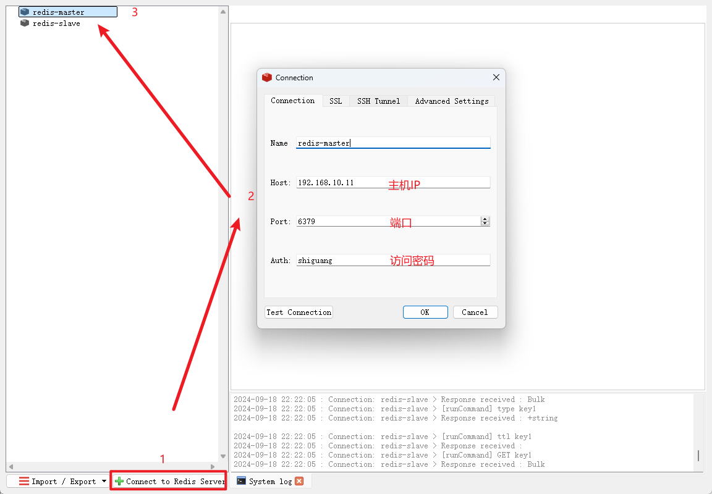

往主节点添加一个key

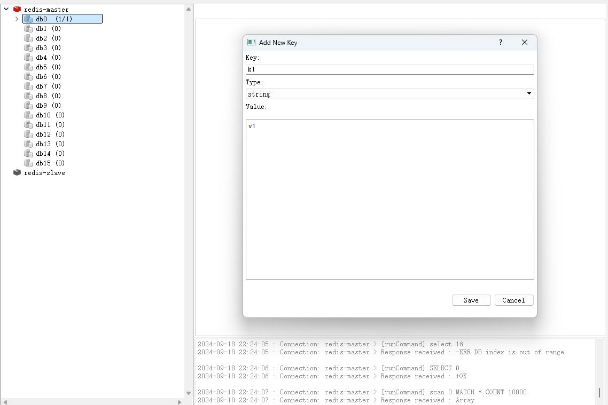

刷新从节点，已自动同步主节点数据

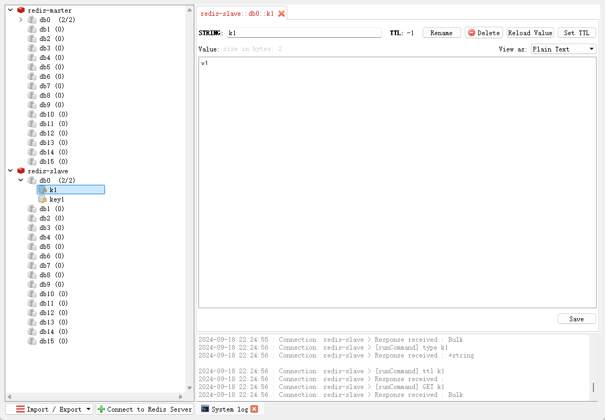

## 启动MySQL

```bash
docker run -d -p 3306:3306 \
-v /home/docker/mysql/config:/etc/mysql/conf.d \
-v /home/docker/mysql/data:/var/lib/mysql \
-e MYSQL_ROOT_PASSWORD=shiguang \
--name mysql \
mysql:8.0.37-debian
```

# Docker compose

Docker Compose 是一个用于定义和运行多容器 Docker 应用程序的工具。通过使用 YAML 文件来配置应用程序的服务、网络和卷，Docker Compose 可以轻松地启动、停止和管理多个容器。

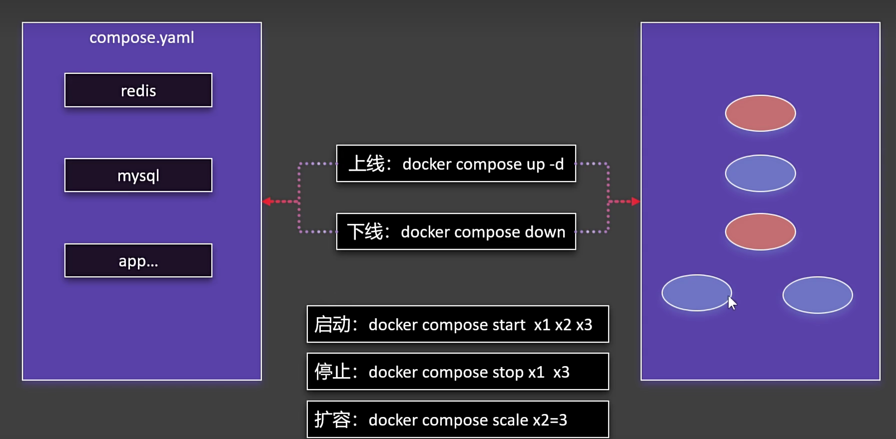


## 常用命令

Docker Compose 提供了许多命令来管理多容器应用程序。以下是一些常用的 Docker Compose 命令及其用法：

### `docker-compose up`
**功能**：启动服务。

**常用选项**：
- `-d`：在后台运行服务。
- `--build`：在启动服务之前构建镜像。
- `--force-recreate`：强制重新创建容器，即使它们的配置和镜像没有改变。

**示例**：

```bash
docker-compose up -d
```

### `docker-compose down`
**功能**：停止并删除服务。

**常用选项**：
- `-v`：删除与服务关联的卷。
- `--rmi all`：删除所有与服务关联的镜像。

**示例**：
```bash
docker-compose down -v
```

### `docker-compose ps`
**功能**：列出正在运行的服务。

**示例**：
```bash
docker-compose ps
```

### `docker-compose logs`
**功能**：查看服务的日志。

**常用选项**：
- `-f`：实时跟踪日志输出。
- `--tail=N`：只显示最后 N 行日志。

**示例**：
```bash
docker-compose logs -f
```

###  `docker-compose build`
**功能**：构建服务镜像。

**常用选项**：
- `--no-cache`：不使用缓存构建镜像。

**示例**：
```bash
docker-compose build --no-cache
```

###  `docker-compose exec`
**功能**：在运行的容器中执行命令。

**常用选项**：
- `-T`：禁用 TTY 分配。
- `-u`：指定用户。

**示例**：
```bash
docker-compose exec web bash
```

### `docker-compose start`
**功能**：启动已停止的服务。

**示例**：
```bash
docker-compose start
```

### `docker-compose stop`
**功能**：停止正在运行的服务。

**示例**：
```bash
docker-compose stop
```

### `docker-compose restart`
**功能**：重启服务。

**示例**：
```bash
docker-compose restart
```

### `docker-compose pull`
**功能**：拉取服务的镜像。

**示例**：
```bash
docker-compose pull
```

###  `docker-compose config`
**功能**：验证并查看 `docker-compose.yml` 文件的配置。

**示例**：
```bash
docker-compose config
```

### `docker-compose run`
**功能**：运行一次性命令。

**常用选项**：
- `-e`：设置环境变量。
- `--rm`：命令完成后删除容器。

**示例**：
```bash
docker-compose run web python manage.py migrate
```

###  `docker-compose scale`
**功能**：扩展服务的实例数量。

**示例**：
```bash
docker-compose scale web=3
```

###  `docker-compose port`
**功能**：查看服务的端口映射。

**示例**：
```bash
docker-compose port web 80
```

### `docker-compose top`
**功能**：查看正在运行的进程。

**示例**：
```bash
docker-compose top
```

### 总结
Docker Compose 提供了丰富的命令来管理多容器应用程序。通过这些命令，可以轻松地启动、停止、重启、构建、查看日志和管理容器。合理使用这些命令可以大大简化开发和部署流程。

## 使用Docker compose启动wordpress

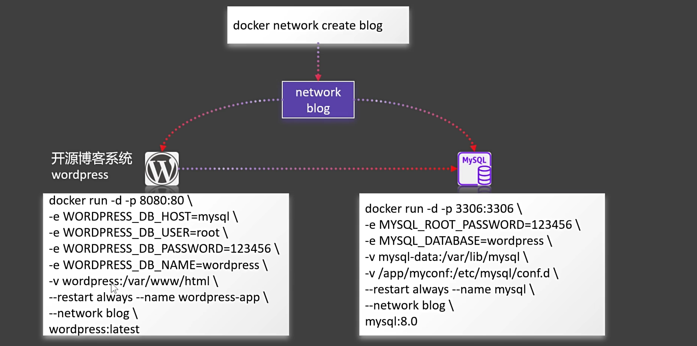


> `docker run` 命令中的 `--restart` 选项用于指定容器在退出时 Docker 守护进程应如何处理容器的重启策略。这个选项非常有用，特别是在生产环境中，确保容器在意外退出时能够自动重启，从而提高服务的可用性。
>
> ### `--restart` 的作用
>
> `--restart` 选项允许你定义容器的重启策略，主要有以下几种策略：
>
> 1. **`no`**：默认策略，容器退出时不会自动重启。
> 2. **`on-failure`**：只有在容器非正常退出（即退出状态码不为 0）时才会自动重启。
> 3. **`always`**：无论容器以何种状态退出，都会自动重启。
> 4. **`unless-stopped`**：与 `always` 类似，但当容器被手动停止（使用 `docker stop` 或 `docker-compose down`）后，即使 Docker 守护进程重启，容器也不会自动启动。

```bash
#创建网络
docker network create blog

#启动mysql
docker run -d -p 3306:3306 \
-e MYSQL_ROOT_PASSWORD=shiguang \
-e MYSQL_DATABASE=wordpress \
-v mysql-data:/var/lib/mysql \
-v /home/mysql/config:/etc/mysql/conf.d \
--restart always --name mysql \
--network blog \
mysql:8.0

#启动wordpress
docker run -d -p 8080:80 \
-e WORDPRESS_DB_HOST=mysql \
-e WORDPRESS_DB_USER=root \
-e WORDPRESS_DB_PASSWORD=shiguang \
-e WORDPRESS_DB_NAME=wordpress \
-v wordpress:/var/www/html \
--restart always --name wordpress-app \
--network blog \
wordpress:latest
```


## compose.yaml

> 官方文档： https://docs.docker.com/reference/compose-file/

```yaml
name: myblog
services:
  mysql:
    container_name: mysql
    image: mysql:8.0
    ports:
      - "3306:3306"
    environment:
      - MYSQL_ROOT_PASSWORD=shiguang
      - MYSQL_DATABASE=wordpress
    volumes:
      - mysql-data:/var/lib/mysql
      - /home/docker/mysql/conf:/etc/mysql/conf.d
    restart: always
    networks:
      - blog

  wordpress:
    image: wordpress
    ports:
      - "8080:80"
    environment:
      WORDPRESS_DB_HOST: mysql
      WORDPRESS_DB_USER: root
      WORDPRESS_DB_PASSWORD: shiguang
      WORDPRESS_DB_NAME: wordpress
    volumes:
      - wordpress:/var/www/html
    restart: always
    networks:
      - blog
    depends_on:
      - mysql

volumes:
  mysql-data:
  wordpress:

networks:
  blog:
```

切换到Docker Compose 文件目录，执行 `docker compose up -d` 启动

启动时也可用 `-f`指定Docker Compose 文件文件名

```bash
docker compose -f compose.yml up -d
```


## 特性

### 增量更新

修改 Docker Compose 文件。重新启动应用。只会触发修改项的重新启动。

### 数据不删

默认就算down了容器，所有挂载的卷不会被移除。比较安全

如果要删除容器的同时删除所有卷，可以使用以下命令

```bash
docker compose down --rmi all -v
```

# Dockerfile

> 官方文档：https://docs.docker.com/reference/dockerfile/

切换到jar包所在目录，通过`java -jar <jar_file>` 启动服务，可以通过`--server.port xxx`指定启动端口

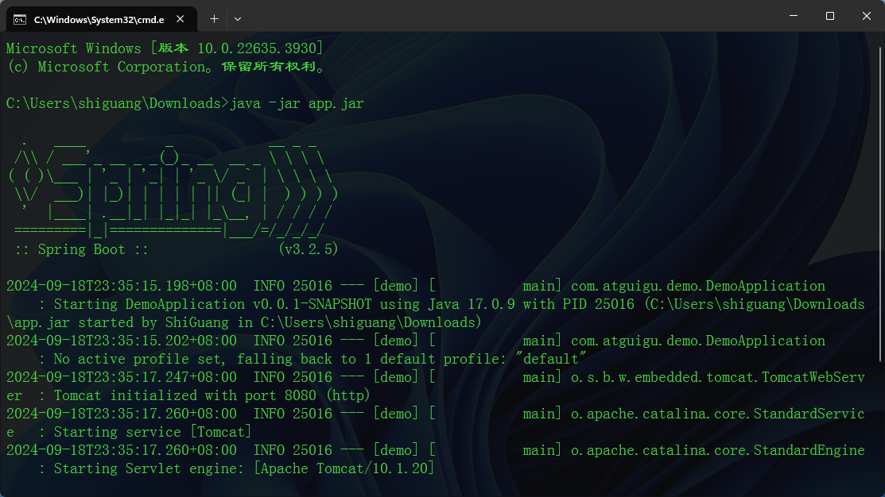

## 通过Dockerfile构建 镜像

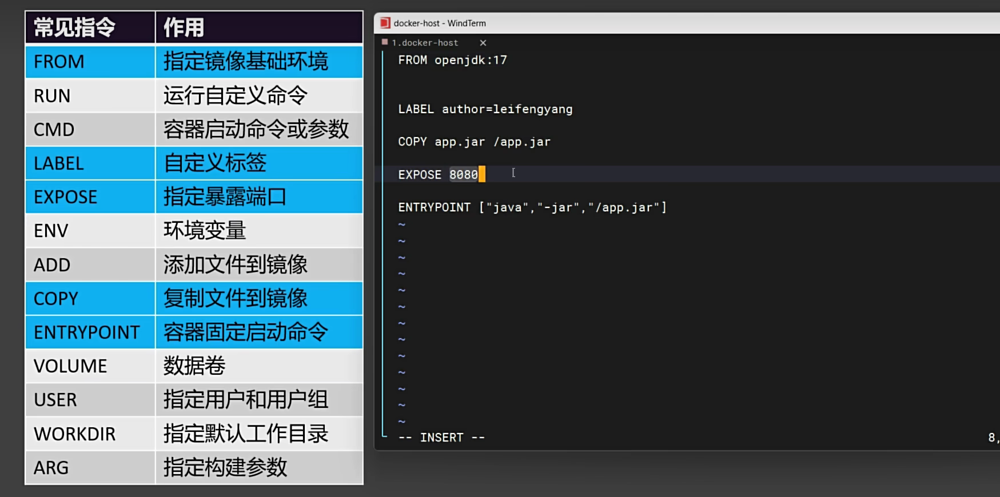

以下是一个简单的示例，文件名称`Dockerfile`
```
FROM openjdk:17

LABEL author=shiguang

COPY app.jar /app.jar

EXPOSE 8080

ENTRYPOINT ["java","-jar","/app.jar"]
```

在当前目录下执行，其中`-t` 代表tag指定版本，`.`代表当前目录

```bash
docker build -f Dockerfile -t myjavaapp:v1.0 .
```

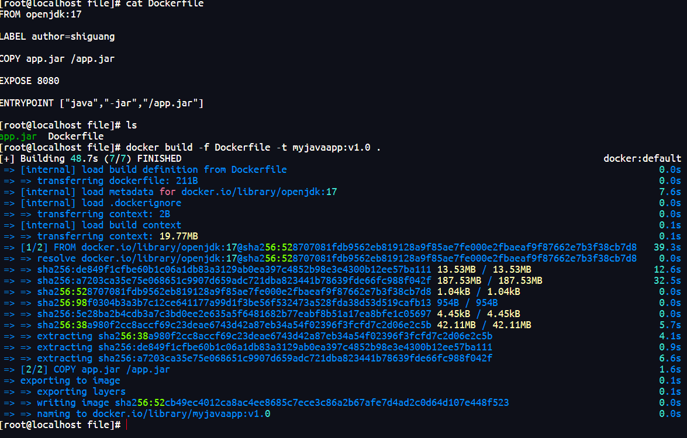

构建好后即可通过`docker images` 查看

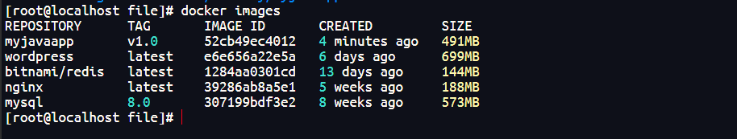

## 镜像分层存储机制

Docker 的分层存储机制是其核心特性之一，它使得镜像的构建、共享和部署变得高效且灵活。分层存储机制通过将镜像和容器的数据存储在不同的层中，实现了镜像的轻量化和快速部署。
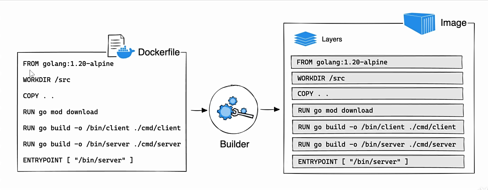

### **分层存储的概念**

Docker 镜像是由一系列只读层（Read-Only Layers）组成的。每一层代表镜像构建过程中的一个步骤，例如安装软件包、添加文件或修改配置。这些层是只读的，一旦创建就不能修改。当容器启动时，Docker 会在这些只读层之上添加一个可写层（Writable Layer），用于存储容器运行时的修改。


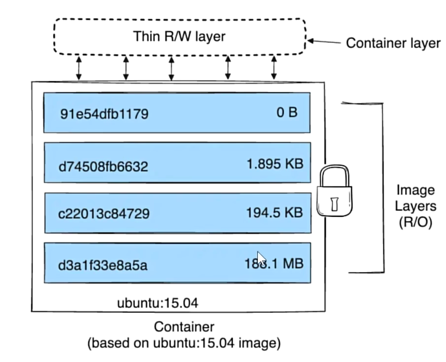

### **分层存储的实现**

#### **镜像层**

- **只读层**：镜像的每一层都是只读的，一旦创建就不能修改。每一层都有一个唯一的标识符（Layer ID），用于在不同的镜像之间共享。
- **层的内容**：每一层包含了文件系统的变化，例如添加、删除或修改的文件。这些变化以增量方式存储，只有发生变化的部分会被存储。

#### **容器层**

- **可写层**：当容器启动时，Docker 会在镜像的最上层添加一个可写层。容器运行时的所有修改（例如创建新文件、修改文件、删除文件）都会存储在这个可写层中。
- **临时性**：容器层的修改是临时的，当容器停止或删除时，这些修改会丢失。如果需要持久化数据，可以使用卷（Volume）或绑定挂载（Bind Mount）。

### **分层存储的示例**

假设我们有一个简单的 Dockerfile：

```
FROM ubuntu:20.04
RUN apt-get update && apt-get install -y nginx
COPY index.html /var/www/html/
CMD ["nginx", "-g", "daemon off;"]
```

在这个 Dockerfile 中，镜像的构建过程可以分为以下几层：

1. **基础层**：`ubuntu:20.04` 镜像。
2. **更新和安装层**：`RUN apt-get update && apt-get install -y nginx`。
3. **文件复制层**：`COPY index.html /var/www/html/`。
4. **启动命令层**：`CMD ["nginx", "-g", "daemon off;"]`。

每一层都是一个只读层，当容器启动时，Docker 会在这些只读层之上添加一个可写层。


# 附录：一键安装超多中间件

```bash
#Disable memory paging and swapping performance
sudo swapoff -a

# Edit the sysctl config file
sudo vi /etc/sysctl.conf

# Add a line to define the desired value
# or change the value if the key exists,
# and then save your changes.
vm.max_map_count=262144

# Reload the kernel parameters using sysctl
sudo sysctl -p

# Verify that the change was applied by checking the value
cat /proc/sys/vm/max_map_count
```


## yaml

> 注意：
>
> - 将下面文件中 kafka 的  119.45.147.122 改为你自己的服务器IP。
> - 所有容器都做了时间同步，这样容器的时间和linux主机的时间就一致了
>   准备一个 `compose.yaml`文件，内容如下：

```yaml
name: devsoft
services:
  redis:
    image: bitnami/redis:latest
    restart: always
    container_name: redis
    environment:
      - REDIS_PASSWORD=123456
    ports:
      - '6379:6379'
    volumes:
      - redis-data:/bitnami/redis/data
      - redis-conf:/opt/bitnami/redis/mounted-etc
      - /etc/localtime:/etc/localtime:ro

  mysql:
    image: mysql:8.0.31
    restart: always
    container_name: mysql
    environment:
      - MYSQL_ROOT_PASSWORD=123456
    ports:
      - '3306:3306'
      - '33060:33060'
    volumes:
      - mysql-conf:/etc/mysql/conf.d
      - mysql-data:/var/lib/mysql
      - /etc/localtime:/etc/localtime:ro

  rabbit:
    image: rabbitmq:3-management
    restart: always
    container_name: rabbitmq
    ports:
      - "5672:5672"
      - "15672:15672"
    environment:
      - RABBITMQ_DEFAULT_USER=rabbit
      - RABBITMQ_DEFAULT_PASS=rabbit
      - RABBITMQ_DEFAULT_VHOST=dev
    volumes:
      - rabbit-data:/var/lib/rabbitmq
      - rabbit-app:/etc/rabbitmq
      - /etc/localtime:/etc/localtime:ro
  opensearch-node1:
    image: opensearchproject/opensearch:2.13.0
    container_name: opensearch-node1
    environment:
      - cluster.name=opensearch-cluster # Name the cluster
      - node.name=opensearch-node1 # Name the node that will run in this container
      - discovery.seed_hosts=opensearch-node1,opensearch-node2 # Nodes to look for when discovering the cluster
      - cluster.initial_cluster_manager_nodes=opensearch-node1,opensearch-node2 # Nodes eligibile to serve as cluster manager
      - bootstrap.memory_lock=true # Disable JVM heap memory swapping
      - "OPENSEARCH_JAVA_OPTS=-Xms512m -Xmx512m" # Set min and max JVM heap sizes to at least 50% of system RAM
      - "DISABLE_INSTALL_DEMO_CONFIG=true" # Prevents execution of bundled demo script which installs demo certificates and security configurations to OpenSearch
      - "DISABLE_SECURITY_PLUGIN=true" # Disables Security plugin
    ulimits:
      memlock:
        soft: -1 # Set memlock to unlimited (no soft or hard limit)
        hard: -1
      nofile:
        soft: 65536 # Maximum number of open files for the opensearch user - set to at least 65536
        hard: 65536
    volumes:
      - opensearch-data1:/usr/share/opensearch/data # Creates volume called opensearch-data1 and mounts it to the container
      - /etc/localtime:/etc/localtime:ro
    ports:
      - 9200:9200 # REST API
      - 9600:9600 # Performance Analyzer

  opensearch-node2:
    image: opensearchproject/opensearch:2.13.0
    container_name: opensearch-node2
    environment:
      - cluster.name=opensearch-cluster # Name the cluster
      - node.name=opensearch-node2 # Name the node that will run in this container
      - discovery.seed_hosts=opensearch-node1,opensearch-node2 # Nodes to look for when discovering the cluster
      - cluster.initial_cluster_manager_nodes=opensearch-node1,opensearch-node2 # Nodes eligibile to serve as cluster manager
      - bootstrap.memory_lock=true # Disable JVM heap memory swapping
      - "OPENSEARCH_JAVA_OPTS=-Xms512m -Xmx512m" # Set min and max JVM heap sizes to at least 50% of system RAM
      - "DISABLE_INSTALL_DEMO_CONFIG=true" # Prevents execution of bundled demo script which installs demo certificates and security configurations to OpenSearch
      - "DISABLE_SECURITY_PLUGIN=true" # Disables Security plugin
    ulimits:
      memlock:
        soft: -1 # Set memlock to unlimited (no soft or hard limit)
        hard: -1
      nofile:
        soft: 65536 # Maximum number of open files for the opensearch user - set to at least 65536
        hard: 65536
    volumes:
      - /etc/localtime:/etc/localtime:ro
      - opensearch-data2:/usr/share/opensearch/data # Creates volume called opensearch-data2 and mounts it to the container

  opensearch-dashboards:
    image: opensearchproject/opensearch-dashboards:2.13.0
    container_name: opensearch-dashboards
    ports:
      - 5601:5601 # Map host port 5601 to container port 5601
    expose:
      - "5601" # Expose port 5601 for web access to OpenSearch Dashboards
    environment:
      - 'OPENSEARCH_HOSTS=["http://opensearch-node1:9200","http://opensearch-node2:9200"]'
      - "DISABLE_SECURITY_DASHBOARDS_PLUGIN=true" # disables security dashboards plugin in OpenSearch Dashboards
    volumes:
      - /etc/localtime:/etc/localtime:ro
  zookeeper:
    image: bitnami/zookeeper:3.9
    container_name: zookeeper
    restart: always
    ports:
      - "2181:2181"
    volumes:
      - "zookeeper_data:/bitnami"
      - /etc/localtime:/etc/localtime:ro
    environment:
      - ALLOW_ANONYMOUS_LOGIN=yes

  kafka:
    image: 'bitnami/kafka:3.4'
    container_name: kafka
    restart: always
    hostname: kafka
    ports:
      - '9092:9092'
      - '9094:9094'
    environment:
      - KAFKA_CFG_NODE_ID=0
      - KAFKA_CFG_PROCESS_ROLES=controller,broker
      - KAFKA_CFG_LISTENERS=PLAINTEXT://:9092,CONTROLLER://:9093,EXTERNAL://0.0.0.0:9094
      - KAFKA_CFG_ADVERTISED_LISTENERS=PLAINTEXT://kafka:9092,EXTERNAL://119.45.147.122:9094
      - KAFKA_CFG_LISTENER_SECURITY_PROTOCOL_MAP=CONTROLLER:PLAINTEXT,EXTERNAL:PLAINTEXT,PLAINTEXT:PLAINTEXT
      - KAFKA_CFG_CONTROLLER_QUORUM_VOTERS=0@kafka:9093
      - KAFKA_CFG_CONTROLLER_LISTENER_NAMES=CONTROLLER
      - ALLOW_PLAINTEXT_LISTENER=yes
      - "KAFKA_HEAP_OPTS=-Xmx512m -Xms512m"
    volumes:
      - kafka-conf:/bitnami/kafka/config
      - kafka-data:/bitnami/kafka/data
      - /etc/localtime:/etc/localtime:ro
  kafka-ui:
    container_name: kafka-ui
    image: provectuslabs/kafka-ui:latest
    restart: always
    ports:
      - 8080:8080
    environment:
      DYNAMIC_CONFIG_ENABLED: true
      KAFKA_CLUSTERS_0_NAME: kafka-dev
      KAFKA_CLUSTERS_0_BOOTSTRAPSERVERS: kafka:9092
    volumes:
      - kafkaui-app:/etc/kafkaui
      - /etc/localtime:/etc/localtime:ro

  nacos:
    image: nacos/nacos-server:v2.3.1
    container_name: nacos
    ports:
      - 8848:8848
      - 9848:9848
    environment:
      - PREFER_HOST_MODE=hostname
      - MODE=standalone
      - JVM_XMX=512m
      - JVM_XMS=512m
      - SPRING_DATASOURCE_PLATFORM=mysql
      - MYSQL_SERVICE_HOST=nacos-mysql
      - MYSQL_SERVICE_DB_NAME=nacos_devtest
      - MYSQL_SERVICE_PORT=3306
      - MYSQL_SERVICE_USER=nacos
      - MYSQL_SERVICE_PASSWORD=nacos
      - MYSQL_SERVICE_DB_PARAM=characterEncoding=utf8&connectTimeout=1000&socketTimeout=3000&autoReconnect=true&useUnicode=true&useSSL=false&serverTimezone=Asia/Shanghai&allowPublicKeyRetrieval=true
      - NACOS_AUTH_IDENTITY_KEY=2222
      - NACOS_AUTH_IDENTITY_VALUE=2xxx
      - NACOS_AUTH_TOKEN=SecretKey012345678901234567890123456789012345678901234567890123456789
      - NACOS_AUTH_ENABLE=true
    volumes:
      - /app/nacos/standalone-logs/:/home/nacos/logs
      - /etc/localtime:/etc/localtime:ro
    depends_on:
      nacos-mysql:
        condition: service_healthy
  nacos-mysql:
    container_name: nacos-mysql
    build:
      context: .
      dockerfile_inline: |
        FROM mysql:8.0.31
        ADD https://raw.githubusercontent.com/alibaba/nacos/2.3.2/distribution/conf/mysql-schema.sql /docker-entrypoint-initdb.d/nacos-mysql.sql
        RUN chown -R mysql:mysql /docker-entrypoint-initdb.d/nacos-mysql.sql
        EXPOSE 3306
        CMD ["mysqld", "--character-set-server=utf8mb4", "--collation-server=utf8mb4_unicode_ci"]
    image: nacos/mysql:8.0.30
    environment:
      - MYSQL_ROOT_PASSWORD=root
      - MYSQL_DATABASE=nacos_devtest
      - MYSQL_USER=nacos
      - MYSQL_PASSWORD=nacos
      - LANG=C.UTF-8
    volumes:
      - nacos-mysqldata:/var/lib/mysql
      - /etc/localtime:/etc/localtime:ro
    ports:
      - "13306:3306"
    healthcheck:
      test: [ "CMD", "mysqladmin" ,"ping", "-h", "localhost" ]
      interval: 5s
      timeout: 10s
      retries: 10
  prometheus:
    image: prom/prometheus:v2.52.0
    container_name: prometheus
    restart: always
    ports:
      - 9090:9090
    volumes:
      - prometheus-data:/prometheus
      - prometheus-conf:/etc/prometheus
      - /etc/localtime:/etc/localtime:ro

  grafana:
    image: grafana/grafana:10.4.2
    container_name: grafana
    restart: always
    ports:
      - 3000:3000
    volumes:
      - grafana-data:/var/lib/grafana
      - /etc/localtime:/etc/localtime:ro

volumes:
  redis-data:
  redis-conf:
  mysql-conf:
  mysql-data:
  rabbit-data:
  rabbit-app:
  opensearch-data1:
  opensearch-data2:
  nacos-mysqldata:
  zookeeper_data:
  kafka-conf:
  kafka-data:
  kafkaui-app:
  prometheus-data:
  prometheus-conf:
  grafana-data:
```

## 启动

> tip：如果重启了服务器，可能有些容器会启动失败。再执行一遍 docker compose up -d即可。所有程序都可运行成功，并且不会丢失数据。请放心使用。

```bash
# 在 compose.yaml 文件所在的目录下执行
docker compose up -d
# 等待启动所有容器
```


## 访问 

> zookeeper可视化工具下载：
>
> https://github.com/vran-dev/PrettyZoo/releases/download/v2.1.1/prettyZoo-win.zip
>
> redis可视化工具下载：
>
> https://github.com/qishibo/AnotherRedisDesktopManager/releases/download/v1.6.4/Another-Redis-Desktop-Manager.1.6.4.exe

| 组件（容器名）                 | 介绍            | 访问地址                  | 账号/密码          | 特性                |
| ------------------------------ | --------------- | ------------------------- | ------------------ | ------------------- |
| Redis(redis)                   | k-v 库          | 你的ip:6379               | 单密码模式：123456 | 已开启AOF           |
| MySQL(mysql)                   | 数据库          | 你的ip:3306               | root/123456        | 默认utf8mb4字符集   |
| Rabbit(rabbit)                 | 消息队列        | 你的ip:15672              | rabbit/rabbit      | 暴露5672和15672端口 |
| OpenSearch(opensearch-node1/2) | 检索引擎        | 你的ip:9200               |                    | 内存512mb；两个节点 |
| opensearch-dashboards          | search可视化    | 你的ip:5601               |                    |                     |
| Zookeeper(zookeeper)           | 分布式协调      | 你的ip:2181               |                    | 允许匿名登录        |
| kafka(kafka)                   | 消息队列        | 你的ip:9092 外部访问:9094 |                    | 占用内存512mb       |
| kafka-ui(kafka-ui)             | kafka可视化     | 你的ip:8080               |                    |                     |
| nacos(nacos)                   | 注册/配置中心   | 你的ip:8848               | nacos/nacos        | 持久化数据到MySQL   |
| nacos-mysql(nacos-mysql)       | nacos配套数据库 | 你的ip:13306              | root/root          |                     |
| prometheus(prometheus)         | 时序数据库      | 你的ip:9090               |                    |                     |
| grafana(grafana)               |                 | 你的ip:3000               | admin/admin        |                     |
